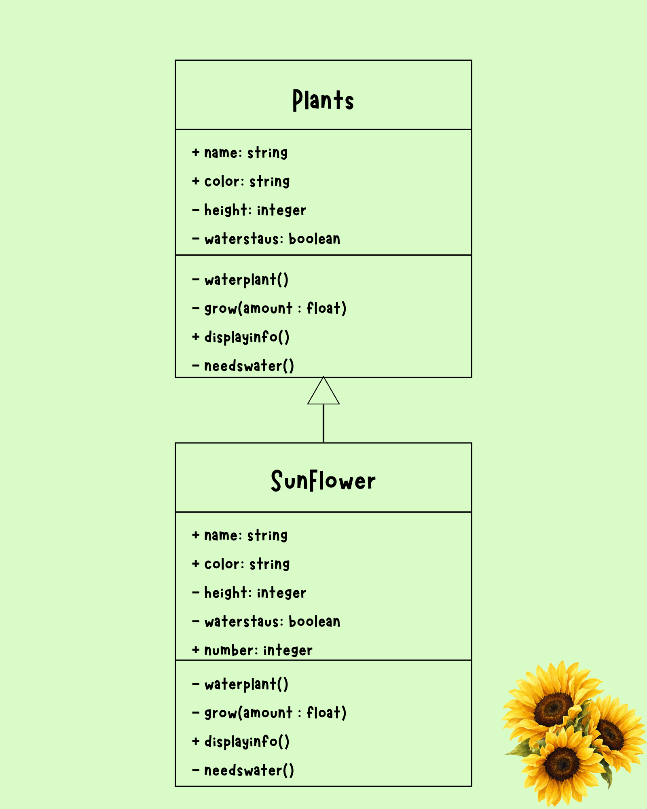
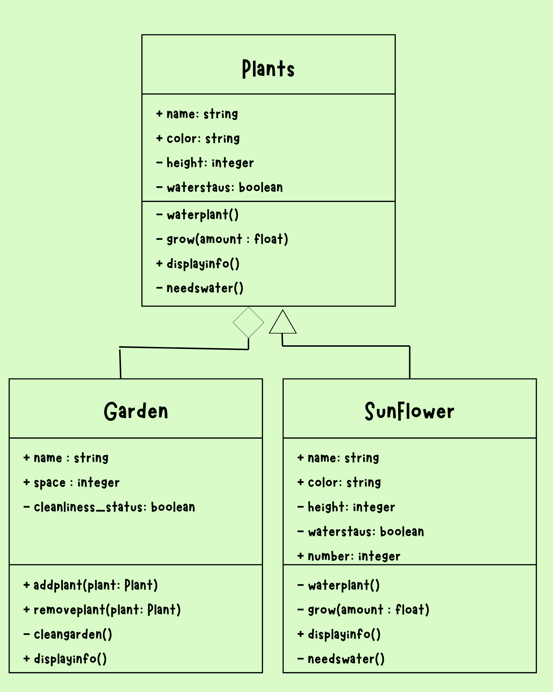
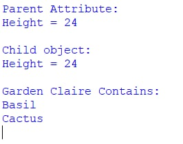
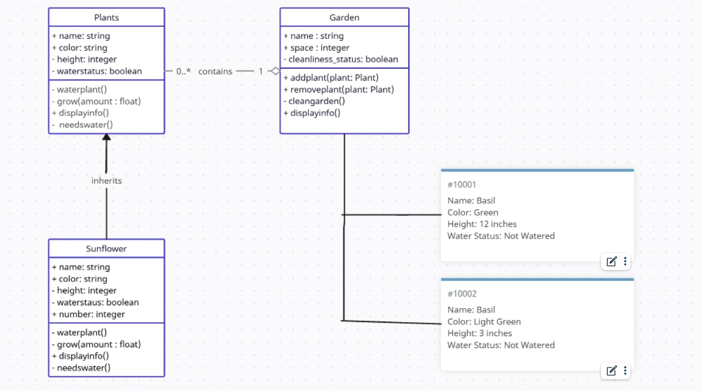

# Advanced Class Relationships
## Previous Activities
[Class Atributes](https://github.com/cmsolano-spec/9siliconcs3/blob/main/q1/classAttributesMethods.md)
[Class Relatioonships](https://github.com/cmsolano-spec/9siliconcs3/blob/main/q1/classRelationships.md)
## Existing System Description:
1. What classes currently exist in your system?
Plants:
- It is a class where the user are able to grow, water and monitor whenever it needs water. Not only that but it also has a name, a color, and height that can grow. 

Garden: 
- It is a class where the user can store and remove plants in it's inventory. The Garden class has a Has-A association with the Plants class. Furthermore, the class Garden has a name, limited inventory space, and the cleanliness status.

2. What problem or limitation exists in your current design?
- The methods I have currently have in both my classes is not that useful and used to its full potential. The said methods and attributes are also repeated through out the classes and can be further improved.

## Inheritance Relationship
Parent: Plant

Child: Sunflower

Explanation: This is because Plants is a broad subject where it consists of different flowers, vegetables, fruits, trees, and shrubs. A Sunflower is a type of plants since it falls under flowers which is a type of plant.

## Inheritance UML

## Composition/Aggregation
Relationship: Aggregation/Weak HAS-A relationship

Class containing another object: GardenClass

Contained object: Plants 

Explanation: This is because Plants can live and exist even if Garden is deleted or removed.
## Advanced UML Diagram

## Python Implementation
[Source Code](advancedRelationships.py)
## Test Run

## Object Diagram

## Reflection
Answers:**
