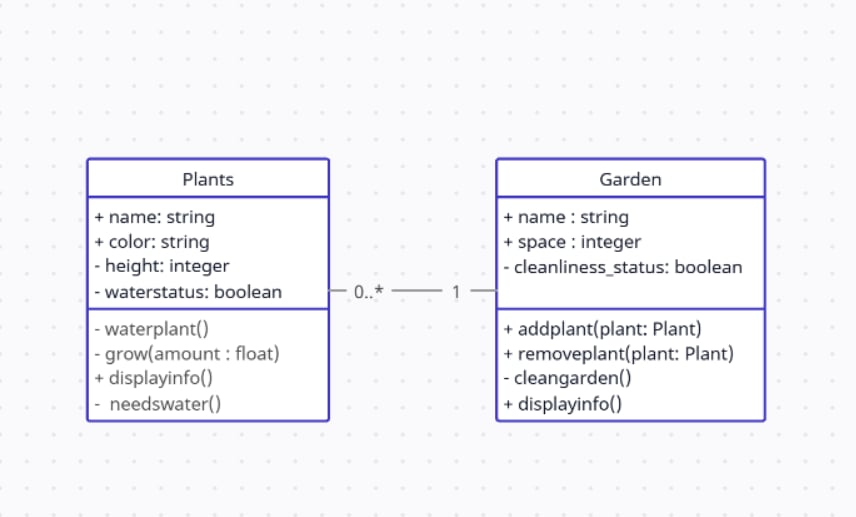
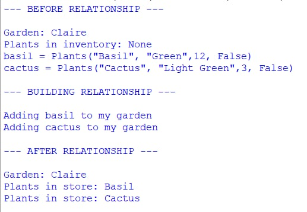
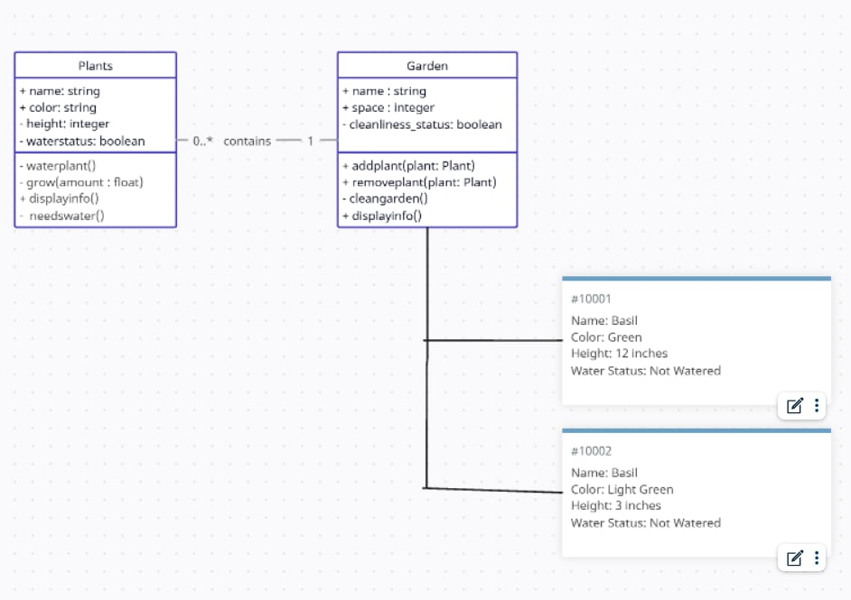

# Class Relationships: Association and Multiplicity
## Previous Work
[Part I - Classes and Objects](https://github.com/cmsolano-spec/9siliconcs3/blob/main/q1/classObjectUML.md)

[Part II - Class Attributes and Methods](https://github.com/cmsolano-spec/9siliconcs3/blob/main/q1/classAttributesMethods.md)

## Existing Class
Class: Plants 
Description: It is a class where different characteristics like its growth or when it needs water is stored.

## New Related Class
Class: Garden
Description: It is a class where plants are stored and taken care of. It has characteristics like to remove, clean, or add plants. 

## Association
Relationship: Has Relationship
Explanation: This is because a garden has plants in it. A garden isn't a plant and also doesn't inherits the plants attributes and methods. 

## Multiplicity
Multiplicity: One-to-Many
Explanation: A garden is a place where many plants can be stored and taken cared of. A space only containing a single plant isn't a garden. 

## UML Class Relationship Diagram

## Python Implementation
[View Python Source](https://github.com/cmsolano-spec/9siliconcs3/blob/main/q1/classImplementation.py)
## Test Run

## Object Relationship Diagram

## Analysis
### What is the association between your two classes?
- The assocition between the two classes is a has a relationship because a Garden has Plants in it. In my system, the Garden class is used to store and take care of the different Plant objects. The Garden doesn't inherit the attributes or methods of the Plants class, but instead forms a sepreparate flexible relationship or system. 

### What multiplicity did you choose and why?
- I have used the one-to-many(1:0...*) multiplicity because you can use one Garden to many different types of Plants. A Garden can also exist independently without any plants contained inside, which is why even zero plants can be allowed. This relationship fits my system because the main purpose of the Garden is to store and take care of none to multiple plants. 
  
### How did you implement the relationship in Python?
- I implemented this relationship by creating a list in the Garden class to store the plants. Not only that but I also made methods that could add plants, remove them, or display them. This way, I can utilize and take care of any plants of any amount inside the Garden class. 

### Why did you store an object reference instead of copying its data?
- I stored the actual object references instead of copying or duplicating it's data to ensure efficiency and less the risks of errors. This is because if I duplicated the data instead if using i directly, then the some of the data would not be updated and would take more effort and time to keep all of the data tracked. Not only that but the code would be wordy and lots more variables would be used which will often lead to confusion and risks of incorrect data. 

### If your relationship uses many, why is a list appropriate?
- Using a list is appropriate because the Garden class needs to hold multiple Plant object references. The self.inventory list contains references to the Plant objects added through the addplant(plant: Plants) method. A list also has useful functions such as append() and remove(), which make it easier to add and remove Plants from the Garden.
